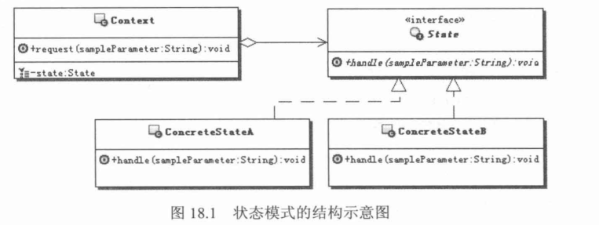

## 定义
当一个对象的内在状态改变时允许改变其行为，这个对象看起来像是改变了其类
## UML



## 应用场景
当一个对象的行为取决于它的状态，并且它必须在运行时刻根据状态改变它的行为，就可以考虑使用状态模式。
## 优点
1、将与特定状态相关的行为局部化，并且将不同状态的行为分割开来。
2、把各种状态转移逻辑分布到State的子类之间
3、状态对象可以保证上下文不会发生内部状态不一致的状况，因为上下文中只有一个变量来记录状态对象

## 缺点
逻辑分散化，状态逻辑分布到了很多State的子类中，很难看到整个的状态逻辑图
##本质
根据状态来分离和选择行为

## 代码示例

```java
package com.cokid.state;

public class AfternoonState extends State {
    @Override
    public void writePrigram(Work w) {
        if(w.getHour() < 17){
            System.out.println("当前时间" + w.getHour() + "下午状态不错，继续努力");
        }else{
            w.setCurrent(new EveningState());
            w.writeProgram();
        }
    }
}
package com.cokid.state;

public class EveningState extends State {
    @Override
    public void writePrigram(Work w) {
        if(w.isFinish()){
            w.setCurrent(new RestState());
            w.writeProgram();
        }else {
            if(w.getHour() < 21){
                System.out.println("当前时间" + w.getHour() + "疲累之极");
            }else{
                w.setCurrent(new SleepingState());
                w.writeProgram();
            }
        }
    }
}
package com.cokid.state;

public class ForenoonState extends State {
    @Override
    public void writePrigram(Work w) {
        if(w.getHour() < 12){
            System.out.println("当前时间" + w.getHour() + "上午工作，精神百倍");
        }else {
            w.setCurrent(new AfternoonState());
            w.writeProgram();
        }
    }
}
package com.cokid.state;

public class RestState extends State {
    @Override
    public void writePrigram(Work w) {
        System.out.println("当前时间" + w.getHour() + "下班回家了");
    }
}
package com.cokid.state;

public class SleepingState extends State {
    @Override
    public void writePrigram(Work w) {
        System.out.println("当前时间" + w.getHour() + "不行了，睡着了");
    }
}
package com.cokid.state;

public abstract class State {
    public abstract void writePrigram(Work w);
}
package com.cokid.state;

public class Work {
    private State current;
    private double hour;

    public State getCurrent() {
        return current;
    }

    public Work() {
        this.current = new ForenoonState();
    }

    public void setCurrent(State current) {
        this.current = current;

    }

    public boolean isFinish() {

        return finish;
    }

    public void setFinish(boolean finish) {
        this.finish = finish;
    }

    private boolean finish = false;
    public double getHour() {
        return hour;
    }

    public void setHour(double hour) {
        this.hour = hour;
    }
    public void writeProgram(){
        current.writePrigram(this);
    }
}
package com.cokid.state;

public class StateClient {
    public static void main(String[] args) {
        Work w = new Work();
        w.setHour(9);
        w.writeProgram();
        w.setHour(10);
        w.writeProgram();
        w.setHour(12);
        w.writeProgram();
        w.setHour(13);
        w.writeProgram();
        w.setHour(14);
        w.writeProgram();
        w.setHour(17);
        w.writeProgram();
        w.setHour(19);
        w.writeProgram();
        w.setHour(22);
        w.writeProgram();
    }
}