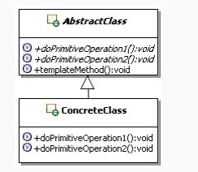

## 定义
定义一个操作中的算法的骨架，而将一些步骤延迟到子类中。模板方法使得子类可以不改变一个算法的结构即可重定义该算法的某些特定步骤。
## UML



## 应用场景
当不变的和可变的行为在方法的子类实现中混合在一起的时候，不变的行为就会在子类中重复出现。通过模板方法把这些行为搬移到单一的地方，这样就帮助子类摆脱重复的不变行为的纠缠。
## 优点
代码复用
## 缺点
算法骨架不容易升级，模板和子类耦合。

## 代码示例

```java
package com.cokid.template;

public class PaperA extends TestPaper{
    @Override
    public String answer1() {
        return "c";
    }

    @Override
    public String answer2() {
        return "b";
    }

    @Override
    public String answer3() {
        return "a";
    }
}
package com.cokid.template;

public class PaperB extends TestPaper {
    @Override
    public String answer1() {
        return "d";
    }

    @Override
    public String answer2() {
        return "b";
    }

    @Override
    public String answer3() {
        return "a";
    }
}
package com.cokid.template;

public abstract  class TestPaper {
    public void TestQuestion1(){
        System.out.println("问题1");
    }
    public void TestQuestion2(){
        System.out.println("问题1");
    }
    public void TestQuestion3(){
        System.out.println("问题1");
    }
    public abstract String answer1();
    public abstract String answer2();
    public abstract String answer3();

}
```