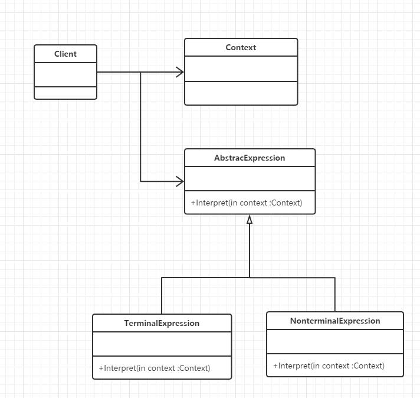

## 定义

给定一个语言，定义它的文法的一种表示，并定义一个解释器，这个解释器使用该表示来解释语言中的句子

## UML



## 应用场景

## 优点

## 缺点

##本质

## 代码示例

```c#
using System;
using System.Collections.Generic;
using System.Text;

namespace 解释器模式
{
    class Program
    {
        static void Main(string[] args)
        {
            Context context = new Context();
            IList<AbstractExpression> list = new List<AbstractExpression>();
            list.Add(new TerminalExpression());
            list.Add(new NonterminalExpression());
            list.Add(new TerminalExpression());
            list.Add(new TerminalExpression());

            foreach (AbstractExpression exp in list)
            {
                exp.Interpret(context);
            }

            Console.Read();
        }
    }

    class Context
    {
        private string input;
        public string Input
        {
            get { return input; }
            set { input = value; }
        }

        private string output;
        public string Output
        {
            get { return output; }
            set { output = value; }
        }
    }

    abstract class AbstractExpression
    {
        public abstract void Interpret(Context context);
    }

    class TerminalExpression : AbstractExpression
    {
        public override void Interpret(Context context)
        {
            Console.WriteLine("终端解释器");
        }
    }

    class NonterminalExpression : AbstractExpression
    {
        public override void Interpret(Context context)
        {
            Console.WriteLine("非终端解释器");
        }
    }
}

```

